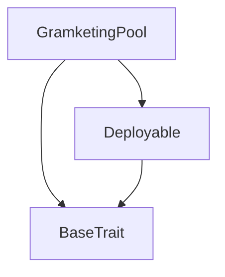
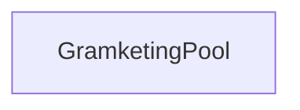

# Tact compilation report
Contract: GramketingPool
BoC Size: 2262 bytes

## Structures (Structs and Messages)
Total structures: 26

### DataSize
TL-B: `_ cells:int257 bits:int257 refs:int257 = DataSize`
Signature: `DataSize{cells:int257,bits:int257,refs:int257}`

### SignedBundle
TL-B: `_ signature:fixed_bytes64 signedData:remainder<slice> = SignedBundle`
Signature: `SignedBundle{signature:fixed_bytes64,signedData:remainder<slice>}`

### StateInit
TL-B: `_ code:^cell data:^cell = StateInit`
Signature: `StateInit{code:^cell,data:^cell}`

### Context
TL-B: `_ bounceable:bool sender:address value:int257 raw:^slice = Context`
Signature: `Context{bounceable:bool,sender:address,value:int257,raw:^slice}`

### SendParameters
TL-B: `_ mode:int257 body:Maybe ^cell code:Maybe ^cell data:Maybe ^cell value:int257 to:address bounce:bool = SendParameters`
Signature: `SendParameters{mode:int257,body:Maybe ^cell,code:Maybe ^cell,data:Maybe ^cell,value:int257,to:address,bounce:bool}`

### MessageParameters
TL-B: `_ mode:int257 body:Maybe ^cell value:int257 to:address bounce:bool = MessageParameters`
Signature: `MessageParameters{mode:int257,body:Maybe ^cell,value:int257,to:address,bounce:bool}`

### DeployParameters
TL-B: `_ mode:int257 body:Maybe ^cell value:int257 bounce:bool init:StateInit{code:^cell,data:^cell} = DeployParameters`
Signature: `DeployParameters{mode:int257,body:Maybe ^cell,value:int257,bounce:bool,init:StateInit{code:^cell,data:^cell}}`

### StdAddress
TL-B: `_ workchain:int8 address:uint256 = StdAddress`
Signature: `StdAddress{workchain:int8,address:uint256}`

### VarAddress
TL-B: `_ workchain:int32 address:^slice = VarAddress`
Signature: `VarAddress{workchain:int32,address:^slice}`

### BasechainAddress
TL-B: `_ hash:Maybe int257 = BasechainAddress`
Signature: `BasechainAddress{hash:Maybe int257}`

### Deploy
TL-B: `deploy#946a98b6 queryId:uint64 = Deploy`
Signature: `Deploy{queryId:uint64}`

### DeployOk
TL-B: `deploy_ok#aff90f57 queryId:uint64 = DeployOk`
Signature: `DeployOk{queryId:uint64}`

### FactoryDeploy
TL-B: `factory_deploy#6d0ff13b queryId:uint64 cashback:address = FactoryDeploy`
Signature: `FactoryDeploy{queryId:uint64,cashback:address}`

### CreatePool
TL-B: `create_pool#b112e4c5 jettonWalletAddress:address totalReward:coins durationDays:uint8 rewardSlots:uint8 = CreatePool`
Signature: `CreatePool{jettonWalletAddress:address,totalReward:coins,durationDays:uint8,rewardSlots:uint8}`

### DistributeRewards
TL-B: `distribute_rewards#efc4063b winners:dict<address, int> = DistributeRewards`
Signature: `DistributeRewards{winners:dict<address, int>}`

### CancelPool
TL-B: `cancel_pool#a5dc73ae winners:dict<address, int> = CancelPool`
Signature: `CancelPool{winners:dict<address, int>}`

### SetJettonWallet
TL-B: `set_jetton_wallet#6eecb8b7 newJettonWalletAddress:address = SetJettonWallet`
Signature: `SetJettonWallet{newJettonWalletAddress:address}`

### AdminRescue
TL-B: `admin_rescue#ac681978 queryId:uint64 amount:coins destination:address = AdminRescue`
Signature: `AdminRescue{queryId:uint64,amount:coins,destination:address}`

### AdminWithdrawTon
TL-B: `admin_withdraw_ton#a1903f15 queryId:uint64 = AdminWithdrawTon`
Signature: `AdminWithdrawTon{queryId:uint64}`

### JettonTransfer
TL-B: `jetton_transfer#0f8a7ea5 queryId:uint64 amount:coins destination:address responseDestination:address customPayload:Maybe ^cell forwardTonAmount:coins forwardPayload:remainder<slice> = JettonTransfer`
Signature: `JettonTransfer{queryId:uint64,amount:coins,destination:address,responseDestination:address,customPayload:Maybe ^cell,forwardTonAmount:coins,forwardPayload:remainder<slice>}`

### JettonTransferNotification
TL-B: `jetton_transfer_notification#7362d09c queryId:uint64 amount:coins sender:address forwardPayload:remainder<slice> = JettonTransferNotification`
Signature: `JettonTransferNotification{queryId:uint64,amount:coins,sender:address,forwardPayload:remainder<slice>}`

### PoolCreated
TL-B: `pool_created#43320e0c jettonWalletAddress:address totalReward:coins durationDays:uint8 rewardSlots:uint8 startTime:uint64 endTime:uint64 = PoolCreated`
Signature: `PoolCreated{jettonWalletAddress:address,totalReward:coins,durationDays:uint8,rewardSlots:uint8,startTime:uint64,endTime:uint64}`

### PoolEnded
TL-B: `pool_ended#f6c074b7 endTime:uint64 = PoolEnded`
Signature: `PoolEnded{endTime:uint64}`

### RewardsDistributed
TL-B: `rewards_distributed#6455af70 totalDistributed:coins winnerCount:uint8 = RewardsDistributed`
Signature: `RewardsDistributed{totalDistributed:coins,winnerCount:uint8}`

### PoolInfo
TL-B: `_ owner:address admin:address jettonWalletAddress:address totalReward:coins depositedAmount:coins durationDays:uint8 rewardSlots:uint8 startTime:uint64 endTime:uint64 status:uint8 = PoolInfo`
Signature: `PoolInfo{owner:address,admin:address,jettonWalletAddress:address,totalReward:coins,depositedAmount:coins,durationDays:uint8,rewardSlots:uint8,startTime:uint64,endTime:uint64,status:uint8}`

### GramketingPool$Data
TL-B: `_ owner:address admin:address nonce:uint64 jettonWalletAddress:address totalReward:coins durationDays:uint8 rewardSlots:uint8 startTime:uint64 endTime:uint64 status:uint8 depositedAmount:coins = GramketingPool`
Signature: `GramketingPool{owner:address,admin:address,nonce:uint64,jettonWalletAddress:address,totalReward:coins,durationDays:uint8,rewardSlots:uint8,startTime:uint64,endTime:uint64,status:uint8,depositedAmount:coins}`

## Get methods
Total get methods: 1

## poolInfo
No arguments

## Exit codes
* 2: Stack underflow
* 3: Stack overflow
* 4: Integer overflow
* 5: Integer out of expected range
* 6: Invalid opcode
* 7: Type check error
* 8: Cell overflow
* 9: Cell underflow
* 10: Dictionary error
* 11: 'Unknown' error
* 12: Fatal error
* 13: Out of gas error
* 14: Virtualization error
* 32: Action list is invalid
* 33: Action list is too long
* 34: Action is invalid or not supported
* 35: Invalid source address in outbound message
* 36: Invalid destination address in outbound message
* 37: Not enough Toncoin
* 38: Not enough extra currencies
* 39: Outbound message does not fit into a cell after rewriting
* 40: Cannot process a message
* 41: Library reference is null
* 42: Library change action error
* 43: Exceeded maximum number of cells in the library or the maximum depth of the Merkle tree
* 50: Account state size exceeded limits
* 128: Null reference exception
* 129: Invalid serialization prefix
* 130: Invalid incoming message
* 131: Constraints error
* 132: Access denied
* 133: Contract stopped
* 134: Invalid argument
* 135: Code of a contract was not found
* 136: Invalid standard address
* 138: Not a basechain address
* 5961: Pool already initialized
* 9050: Already distributed
* 11957: Only admin can rescue tokens
* 19935: Pool not ended yet
* 29498: Only owner can create pool
* 33515: Minimum 3 reward slots required
* 34390: Only admin can cancel pool
* 42780: Only admin can set jetton wallet
* 43187: Only admin can distribute rewards
* 52626: Only admin can end pool
* 53782: Pool not active
* 55690: Duration must be 7, 14, 21, or 28 days
* 59788: Only admin can withdraw TON
* 62796: Only jetton wallet can notify

## Trait inheritance diagram

## Contract dependency diagram

